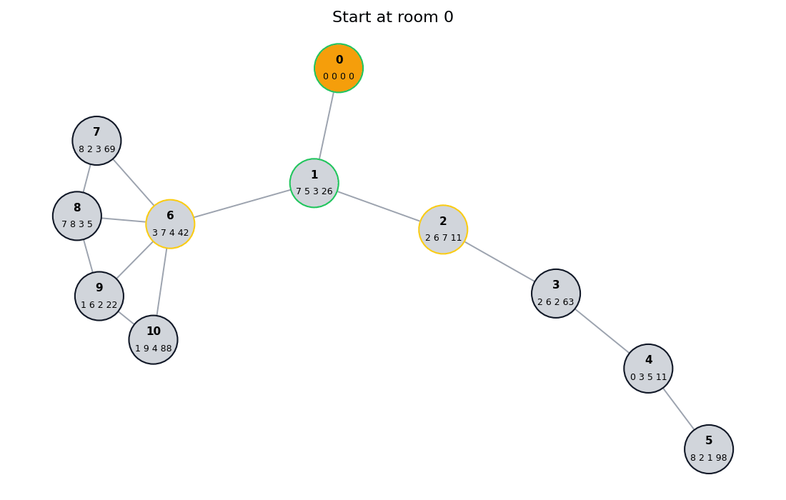

# Улучшения алгоритма

Предложенный алгоритм достаточно простой, но имеет ряд недостатков, описаны
которые будут ниже

## Проблемы исходного алгоритма

### Фиксированная граница для перехода между фазами

Переход между фазой исследования и фазой возвращения привязан к фиксированному
значению, что:

1. Не всегда может быть оптимально (т.к. путь до входа может быть короче чем
   половина от пройденного до этого пути)
2. Большее количество еды может приводить к худшим результатам (см. пример)

Для демонстрации этих проблем рассмотрим следующие входные данные:

```txt
10
0 1
1 0,2,6 7 5 3 26
2 1,3 2 6 7 11
3 2,4 2 6 2 63
4 3,5 0 3 5 11
5 4 8 2 1 98
6 1,7,8,9,10 3 7 4 42
7 6,8 8 2 3 69
8 6,7,9 7 8 3 5
9 6,8,10 1 6 2 22
10 6,9 1 9 4 88
15 gems

```

При прогоне бота на этих данных он соберёт ресурсов на общую ценность `643`, но
если мы выдадим боту не `15`, а `19` единиц еды, то он соберёт ресурсов меньше,
на общую ценность `590`. Это происходит из-за того что при большем количестве
еды при переходе к фазе возвращения бот будет ближе ко входу, а значит будет
меньше собирать ресурсов по пути к входу, несмотря на излишки еды

#### Визуализация примера с `15` единицами еды



#### Визуализация примера с `19` единицами еды

