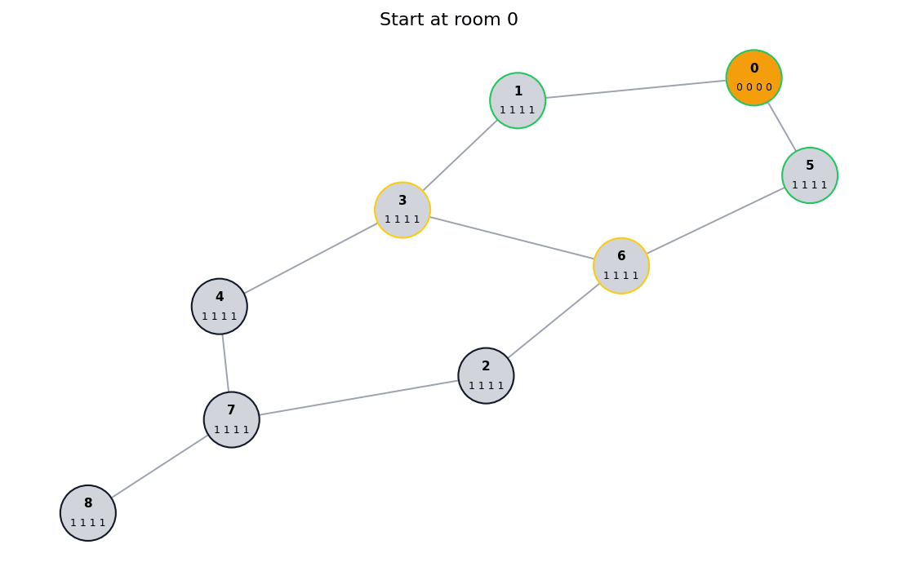

# Анализ и улучшения алгоритма

Предложенный алгоритм достаточно простой, но имеет ряд недостатков, описаны
которые будут ниже

## Проблемы исходного алгоритма

### Фиксированная граница для перехода между фазами

Переход между фазой исследования и фазой возвращения привязан к фиксированному
значению, из-за этого:

1. Большее количество еды может приводить к худшим результатам
2. Бот будет пытаться продолжать исследования даже тогда, когда это уже не
   выгодно

Для демонстрации этих проблем рассмотрим следующие входные данные:

```txt
10
0 1
1 0,2,6 7 5 3 26
2 1,3 2 6 7 11
3 2,4 2 6 2 63
4 3,5 0 3 5 11
5 4 8 2 1 98
6 1,7,8,9,10 3 7 4 42
7 6,8 8 2 3 69
8 6,7,9 7 8 3 5
9 6,8,10 1 6 2 22
10 6,9 1 9 4 88
15 gems

```

При прогоне бота на этих данных он соберёт ресурсов на общую ценность `643`, но
если мы выдадим боту не `15`, а `19` единиц еды, то он соберёт ресурсов меньше,
на общую ценность `590`. Это происходит из-за того что при большем количестве
еды при переходе к фазе возвращения бот будет ближе ко входу, а значит будет
меньше собирать ресурсов по пути к входу, несмотря на излишки еды

| 15 единиц еды                                                      | 19 единиц еды                                                      |
| ------------------------------------------------------------------ | ------------------------------------------------------------------ |
|  |  |

Соответственно для перехода между фазами нужна более гибкая логика, которая
будет учитывать не только количество доступной еды, но и количество ресурсов,
которые можно получить при определённой конфигурации (например учитывать
количество доступной еды, расстояние до входа и возможность получения ресурсов
при пути обратно)

### Неэффективное исследование

При исследовании бот учитывает только индексы комнат и расстояния до ближайшей
неисследованной комнаты, однако в фазе исследования ценность исследования
каждой отдельной комнаты может быть разной, например если комната имеет связь
с большим количеством других комнат, то она может быть более ценной для
исследования, так как позже из этой комнаты можно будет попасть в большее
количество других комнат, а значит потенциально собрать больше ресурсов

Для демонстрации этой проблемы рассмотрим следующие входные данные:

```txt
9
0 1
1 2,3 1 1 1 1
2 1,4,5 1 1 1 1
3 1,6,7,8,9 1 1 1 1
4 2 1 1 1 1
5 2 1 1 1 1
6 3 1 1 1 1
7 3 1 1 1 1
8 3 1 1 1 1
9 3 1 1 1 1
14 gold

```

При запуске бота на этих данных он соберёт ресурсов на общую ценность `64`,
однако если мы оставим структуру подземелья такой же, но поменяем местами
индексы комнат 2 и 3, то бот соберёт ресурсов на общую ценность `87`, так как
сможет посетить больше комнат

| Исходные данные                                                          | Индексы комнат 2 и 3 поменяны местами                                    |
| ------------------------------------------------------------------------ | ------------------------------------------------------------------------ |
|  |  |

Соответственно для исследования нужно учитывать не только расстояния до
ближайшей неисследованной комнаты, но и эвристическую ценность исследования
каждой комнаты, которая может быть рассчитана на основе количества связей
комнаты с другими комнатами

### Возвращение только по пройденным комнатам и добыча ресурсов при возвращении

При возвращении бот может двигаться только по комнатам, которые он уже посетил,
однако в некоторых случаях может быть известен маршрут по комнатам, которые
бот не посещал. При этом такой маршрут может быть более выгодным, так как
добыча ресурсов в непосещённых комнатах всегда бесплатная, соответственно при
построении маршрута через такие комнаты можно добыть дополнительные ресурсы

Для демонстрации этой проблемы рассмотрим следующие входные данные:

```txt
8
0 1,5
1 0,3 1 1 1 1
2 6,7 1 1 1 1
3 1,4,6 1 1 1 1
4 3,7 1 1 1 1
5 0,6 1 1 1 1
6 2,3,5 1 1 1 1
7 2,4,8 1 1 1 1
8 7 1 1 1 1
9 exp

```

При запуске бота на этих данных он соберёт ресурсов на общую ценность `54`, но
при возможности двигаться по непосещённым комнатам он сможет собрать ресурсов
на общую ценность `90`

| Возвращение только по пройденным комнатам                        | Возможность двигаться по непосещённым комнатам                   |
| ---------------------------------------------------------------- | ---------------------------------------------------------------- |
|  |  |

Соответственно для возвращения нужно учитывать не только комнаты, которые бот
посетил, но и комнаты, которые он не посещал и сделать такие комнаты более
приоритетными для построения маршрута

Также при возвращении не учитывается ценность ресурсов, которые можно добыть по
пути к входу: всегда добывается максимально возможное количество ресурсов в
каждой комнате. При этом может быть более выгодным добывать меньше ресурсов в
одной комнате, чтобы потом добыть более ценные ресурсы в другой комнате

## Улучшения алгоритма

### Динамический контроль запаса еды

Вместо правила с фиксированной границей для перехода между фазами,
можно использовать динамический контроль запаса еды, чтобы поддерживать
инвариант, что бот всегда будет иметь достаточно еды для возвращения к входу

#### Плюсы динамического контроля запаса еды

- Бот будет тратить всю доступную еду
- Бот не будет тратить слишком мало еды на исследования, если выгодно
  продолжать исследования
- Бот не будет тратить слишком много еды на исследования, если путь ко входу
  получился слишком длинный

#### Минусы динамического контроля запаса еды

- Необходимо пересчитывать оптимальный путь к входу после каждого действия,
  что может быть дорогостоящим
- Алгоритм становится сложнее

### Выбор комнаты опираясь на её ценность

Текущий выбор комнаты для исследования никак не привязывается к тому, что
находится в комнате и какие пути она открывает. Вместо этого лучше ввести
понятие ценности комнаты, которая может быть рассчитана на основе эвристики:

```text
score(room) =
   expected_value(room)
   + exploration_bonus(room)
   - movement_cost(room)
   - return_risk(room)
```

Где:

- `expected_value(room)` - ожидаемая ценность ресурсов, которые можно добыть в
  комнате
- `exploration_bonus(room)` - бонус за исследование комнаты, который может быть
  рассчитан на основе количества связей комнаты с другими комнатами
- `movement_cost(room)` - сколько еды нужно потратить, чтобы дойти
- `return_risk(room)` - насколько увеличивается путь возврата

#### Плюсы выбора комнаты опираясь на её ценность

- Бот будет исследовать более ценные комнаты, что может привести к лучшим
  результатам
- Бот не будет идти в бесполезную ветку опираясь только на её индекс

#### Минусы выбора комнаты опираясь на её ценность

- Необходимо рассчитывать ценность каждой комнаты, что может быть дорогостоящим
- Эвристика не гарантирует лучший результат, может сходиться к локальному
  оптимуму
- Необходимо подбирать эвристику, которая будет работать хорошо на разных
  входных данных

### Возврат в том числе по непосещённым комнатам

Так как возврат принял теперь имеет функцию "эвакуации", то на обратном пути
он не будет добывать ресурсы в непосещённых комнатах, но при этом если на пути
к входу есть непосещённые комнаты, то бот может двигаться по ним, так как
добыча ресурсов в таких комнатах бесплатная, соответственно при построении
маршрута через такие комнаты можно добыть дополнительные ресурсы

#### Плюсы возврата в том числе по непосещённым комнатам

- Бот может добывать ресурсы в непосещённых комнатах, что может привести к
  лучшим результатам

#### Минусы возврата в том числе по непосещённым комнатам

- Необходимо учитывать непосещённые комнаты при построении маршрута к входу,
  что может быть дороже в плане вычислений

## Алгоритм после улучшений

1. В начале каждого шага бот запоминает ценность текущей комнаты при первом
   посещении. Для комнат с неизвестными ресурсами дальше используется средняя
   ценность уже впервые посещённых комнат
2. Если в текущей комнате доступна бесплатная добыча, бот сразу собирает самый
   ценный ресурс
3. Бот пересчитывает кратчайший известный путь до входа и поддерживает правило
   `food_left >= distance_to_entrance`. Если еды осталось только на возврат, он
   переходит в режим возвращения
4. В режиме исследования бот оценивает доступные непосещённые комнаты по
   формуле `expected_value + exploration_bonus - movement_cost - return_risk`.
   Ценность непосещённых комнат умножается на `2`, потому что такая комната
   может дать бесплатную добычу и открыть новые комнаты для исследования
5. `exploration_bonus` учитывает количество связей комнаты, соседние
   непосещённые комнаты и бонусы соседей на глубину до `3`. Для проходных
   комнат добавляется отдельный бонус, так как они дают доступ к большему
   числу новых комнат
6. Сначала бот выбирает лучшую соседнюю непосещённую комнату. Если такой
   комнаты нет, он строит путь к лучшей доступной непосещённой комнате. При
   равной оценке выбирается меньший индекс комнаты
7. В режиме возвращения бот строит маршрут ко входу не только через посещённые,
   но и через доступные непосещённые комнаты. Среди маршрутов выбирается тот,
   где больше непосещённых комнат, затем выше ожидаемая ценность ресурсов,
   затем короче путь, затем меньше индекс следующей комнаты
8. Если после сохранения еды на возврат остаётся запас, бот может добывать
   дополнительные ресурсы. Это разрешено только при
   условии если `food_left > distance_to_entrance`
