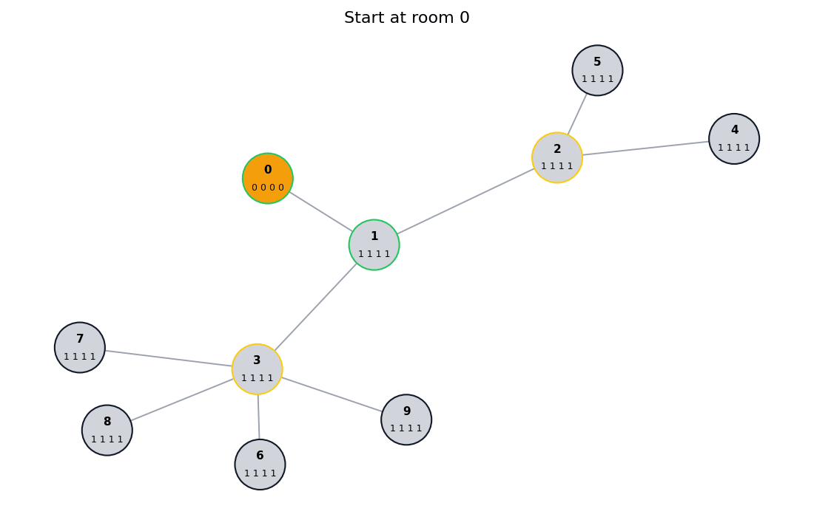
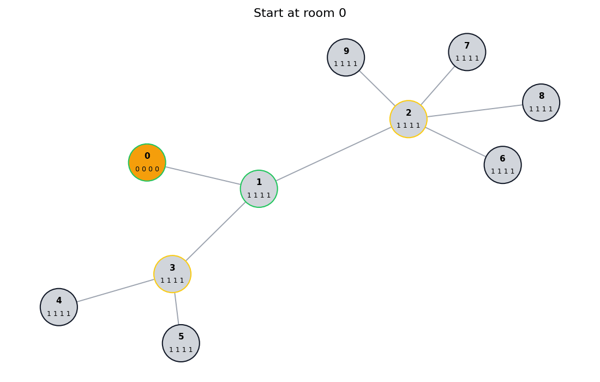

# Улучшения алгоритма

Предложенный алгоритм достаточно простой, но имеет ряд недостатков, описаны
которые будут ниже

## Проблемы исходного алгоритма

### Фиксированная граница для перехода между фазами

Переход между фазой исследования и фазой возвращения привязан к фиксированному
значению, из-за этого:

1. Большее количество еды может приводить к худшим результатам
2. Бот будет пытаться продолжать исследования даже тогда, когда это уже не
   выгодно

Для демонстрации этих проблем рассмотрим следующие входные данные:

```txt
10
0 1
1 0,2,6 7 5 3 26
2 1,3 2 6 7 11
3 2,4 2 6 2 63
4 3,5 0 3 5 11
5 4 8 2 1 98
6 1,7,8,9,10 3 7 4 42
7 6,8 8 2 3 69
8 6,7,9 7 8 3 5
9 6,8,10 1 6 2 22
10 6,9 1 9 4 88
15 gems

```

При прогоне бота на этих данных он соберёт ресурсов на общую ценность `643`, но
если мы выдадим боту не `15`, а `19` единиц еды, то он соберёт ресурсов меньше,
на общую ценность `590`. Это происходит из-за того что при большем количестве
еды при переходе к фазе возвращения бот будет ближе ко входу, а значит будет
меньше собирать ресурсов по пути к входу, несмотря на излишки еды

| 15 единиц еды                                                      | 19 единиц еды                                                      |
| ------------------------------------------------------------------ | ------------------------------------------------------------------ |
|  |  |

Соответственно для перехода между фазами нужна более гибкая логика, которая
будет учитывать не только количество доступной еды, но и количество ресурсов,
которые можно получить при определённой конфигурации (например учитывать
количество доступной еды, расстояние до входа и возможность получения ресурсов
при пути обратно)

### Неэффективное исследование

При исследовании бот учитывает только индексы комнат и расстояния до ближайшей
неисследованной комнаты, однако в фазе исследования ценность исследования
каждой отдельной комнаты может быть разной, например если комната имеет связь
с большим количеством других комнат, то она может быть более ценной для
исследования, так как позже из этой комнаты можно будет попасть в большее
количество других комнат, а значит потенциально собрать больше ресурсов

Для демонстрации этой проблемы рассмотрим следующие входные данные:

```txt
9
0 1
1 2,3 1 1 1 1
2 1,4,5 1 1 1 1
3 1,6,7,8,9 1 1 1 1
4, 2 1 1 1 1
5, 2 1 1 1 1
6, 3 1 1 1 1
7, 3 1 1 1 1
8, 3 1 1 1 1
9, 3 1 1 1 1
14 gold

```

При запуске бота на этих данных он соберёт ресурсов на общую ценность `64`,
однако если мы оставим структуру подземелья такой же, но поменяем местами
индексы комнат 2 и 3, то бот соберёт ресурсов на общую ценность `87`, так как
сможет посетить больше комнат

| Исходные данные                                                          | Индексы комнат 2 и 3 поменяны местами                                    |
| ------------------------------------------------------------------------ | ------------------------------------------------------------------------ |
|  |  |

Соответственно для исследования нужно учитывать не только расстояния до
ближайшей неисследованной комнаты, но и эвристическую ценность исследования
каждой комнаты, которая может быть рассчитана на основе количества связей
комнаты с другими комнатами
