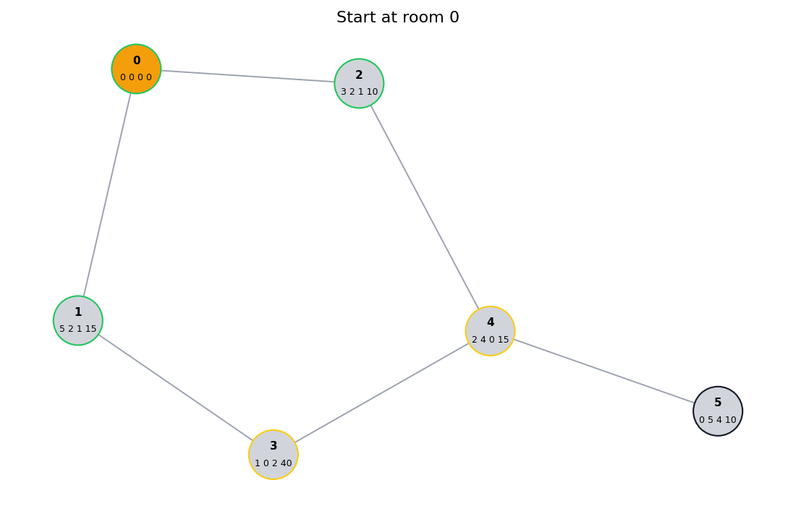
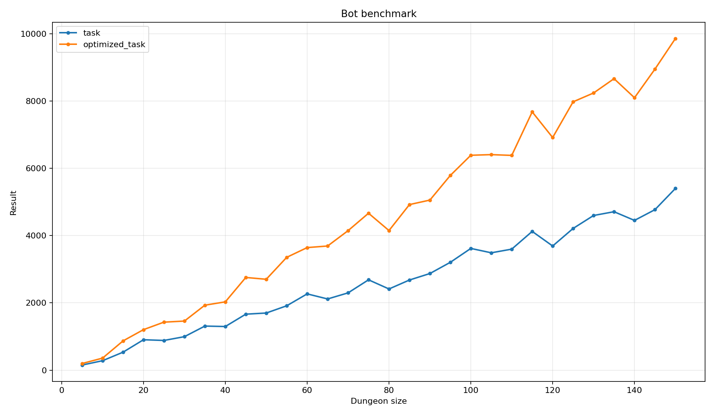

# Yadro practice assignment: Task 1

<div style="width: 100%; display: flex; justify-content: center; align-items: center;">
  
</div>

Description: [markdown](./assets/TASK.md) / [pdf](./assets/task.pdf)

This folder provides my solution for the first task of YADRO practice
assignment. Description of the task can be found in `TASK.md` file (english)
or `task.pdf` (russian)

## How to run

To run the solution, you need to have CMake and a C++ compiler installed on the
system. Then, you can follow these steps:

```bash
git clone https://github.com/Armemius/YadroPracticeAssignment
cd YadroPracticeAssignment/task-1
mkdir build
cd build
cmake ..
cmake --build .
```

Then you can run the program with:

```bash
./task <input_file>
```

Where `<input_file>` is the path to the input file containing the data for the
task. The program will read the input file, process the data,
and output the results to file `result.txt`

## Scripts

To run scripts you need to install Python 3 and the required dependencies.
You can do this by running:

```bash
pip install -r scripts/requirements.txt
```

## Features

Along with bot simulation, the repository contains tests for the game engine
behaviour and bot that can be found in `test` folder. Implementation contains
two bots:

- `task`: original bot algo
- `optimized_task`: bot with improvements described in `IMPROVEMENTS.md`

Some utility scripts were also implemented, such as:

- `scripts/generator.py`: generator of random input data for testing
- `scripts/visualization.py`: script for containing visualizations of bot's
  behaviour
- `scripts/benchmark.py`: script for benchmarking bots on random data

## Visualization

Here is visualization of original input data with original and optimized bot
behaviours

| Original bot behaviour                                     | Optimized bot behaviour                                      |
| ---------------------------------------------------------- | ------------------------------------------------------------ |
|  |  |

## Benchmarking

Benchmarking was performed on both bots implementations with following command:

```bash
python scripts/benchmark.py task optimized_task --max-rooms 150
```



